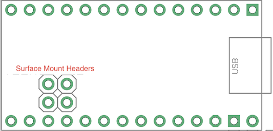

# Hardware

## Teensy Motherboard 8CV

Motherboard for teensy containing circuits to enable the following:

- 8 CV Inputs
- 8 Potentiometer Inputs
- 8 CV Outputs using DAC8164
- 16 Digital Inputs or Outputs using MCP23S17 IO expander

Works with Teensy LC/4.0/4.1

### Soldering

Depending on requirements not all of the components need to be soldered.

Do not solder both section A and B at the same time.
- **A.** Solder these resistors if there are 4 or less potentiometers. They connect the potentiometers directy to analog input on the Teensy. 
- **B.** Solder the CD4051 if there are more than 4 potentiometers. They will be multiplexed to a sinlge analog input on the Teensy.
- **C.** 8 control voltage inputs with range -5V to 5V.
- **D.** IO expander providing 16 digital input or output pins.
- **E.** 8 control voltage outputs with a range from -5V to 5V. If only 4 outputs are required then only one of DAC8164 need to soldered. 

### Board Pins

- **POT 1-8**: Potentiometer connections. Potentiometers should output a voltage from 0V to 3.3V. Values higher will damage the Teensy.
- **CVIN 1-8**: 8 Control Voltage inputs which accept a range from -5V to 5V. Each input has 2 pins which are summed together, but won't go outside the range. e.g. summing 5V+5V will still read 5V on the Teensy. Input is tolerant to -12V/+12V.
- **DOUT/DIN 1-16**: Digital input/output. Pins need to be configured in softare for either input or output. Outputs 5V when turned on. Input is tolerant to -12V/+12V.
- **CVOUT 1-8**: 8 Control voltage outputs with a default range from -5V to 5V.
- **OFFSET**: Applying a voltage will apply an offset to the CV outputs. Apply -5V to produce a 0V to 10V range.
- **28-41**: Numbered Teensy pins, from Teensy 4.1 only.
- **0-13**: Numbered Teensy pins, can be used if the alternative function is not in use.
- **SDA/SCL**: I2C Communication.
- **ENC1/ENC2/ENCBT**: Suggested to use for rotary encoder.
- **TX/RX**: Serial communication.
- **INTB/INTA**: If digital inputs are in use, then these are connected to interrupt pins on the MCP23S17.
- **SCK/MISO/MOSI**: SPI Communication.
- **IOCS**: SPI select pin for MCP23S17 digital inputs/outputs. Do not use if digital inputs/outputs are in use.
- **DAC1CS/DAC2CS**: SPI select pin for DAC8164 analog outputs. Do not use if anaolog outputs are in use.

### Teensy Connections

#### Teensy LC

#### Teensy 4.0

#### Teensy 4.1

