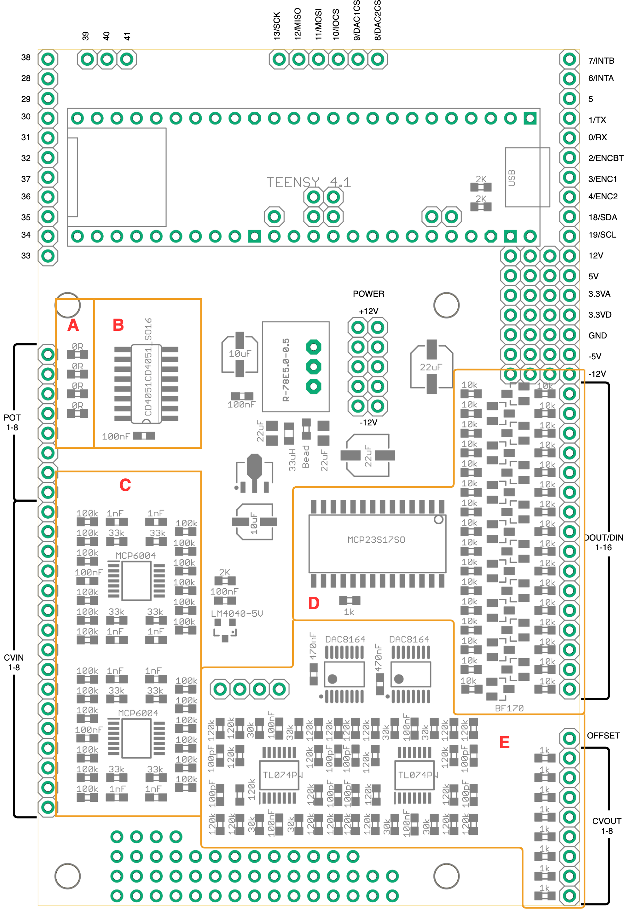

# Hardware

## Teensy Motherboard 8CV

Motherboard for teensy containing circuits to enable the following:

- 8 CV Inputs
- 8 Potentiometer Inputs
- 8 CV Outputs using DAC8164
- 16 Digital Inputs or Outputs using MCP23S17 IO expander

Works with Teensy LC/4.0/4.1

Depending on requirements not all of the components need to be soldered.

