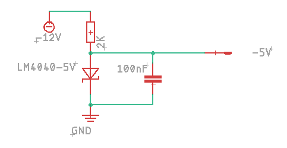

# Input / Output API

## Defining Pin Types

All pins are represented by a DevicePin object. These are provided by either a secondary device or can be one of the pins directly connected to the microcontroller.
For the latter there are some macros with can be used to create the pin objects

### Analog Input

    AnalogInput(analogInputPin, A8)

This is a macro which creates an object of type `AnalogInputPin<NativeDevice>`. 
Where analogInputPin is the name of the variable created to represent the pin and A8 is the arduino analog pin number. 

Example circuit. Uses an inverting rail-to-rail op-amp powered by 3.3V. Scales an input of -5V/5V to 3.3V/0V required by the Arduino. 
The values are then re-inverted by the library code. Requires a -5V reference voltage.

-5V Reference circuit:

### Digital Input

    DigitalInput(digitalInputPin, 0)

This is a macro which creates an object of type `DigitalInputPin<NativeDevice>`. 
Where digitalInputPin is the name of the variable created to represent the pin and 0 is the arduino digital pin number. 

Example circuit.

### Digital Output

    DigitalOutput(digitalOutputPin, 1)

This is a macro which creates an object of type `DigitalOutputPin<NativeDevice>`. 
Where digitalOutputPin is the name of the variable created to represent the pin and 1 is the arduino digital pin number. 

### Analog Input Summing

Two named analog input pins can be summed together using AnalogInputSumPin.

    AnalogInputSumPin<> waveSumPin = AnalogInputSumPin<>(wavePotPin, waveCvPin);

---

## Input/Output Modifiers

A pin definition can then be used with a modifier to change the way it behaves.
The modifier template requires the type of device that the pin is part of.

If using a direct connection to a microcontroller pin then the default NativeDevice can be used e.g.

    LinearInput<> cvInput = LinearInput<>(analogInputPin, -5, 5, 0, 10);

If using an IO expander then it should use the name of the IO expander device:

    LinearInput<AnalogInputPin<MAX11300>> cvInput = LinearInput<AnalogInputPin<MAX11300>>(analogInputPin, -5, 5, 0, 10);

Using this system allows us to change hardware without having to do a major refactor of code.

### Analog Input Modifiers

#### LinearInput

Changes the range of the values for an analog input.

    LinearInput<> cvInput = LinearInput<>(analogInputPin, INPUT_VOLTAGE_MIN, INPUT_VOLTAGE_MAX, OUTPUT_VALUE_MIN, OUTPUT_VALUE_MAX);

In main loop get value with:

    if(potInput.update()) {
        float value = potInput.getValue();
    }

#### ExpInput

Useful for frequency controls and other input that require an exponential response

    ExpInput<> pitchInput = ExpInput<>(analogInputPin, MID_VALUE);

MID_VALUE defaults to 523.25 (Frequency of MIDI note C5). Every 1 volt higher doubles the value, every 1 volt lower halfs the value.

#### AnalogGateInput

Use an analog input like to get a gate signal. Useful if an analog pin can be sometimes used like a gate.

    AnalogGateInput<> gateInput = AnalogGateInput<>(analogInputPin, GATE_ON_VOLTAGE);

GATE_ON_VOLTAGE is the voltage above which the gate is considered on. Defaults to 2.0V.

To detect when gate is first triggered on or off:

    if(gateInput.update()) {
        if(gateInput.isTriggeredOn()) {

        } else if (gateInput.isTriggeredOff()) {
            
        }
    }

To get current state of gate:

    bool trigger = gateInput.isGateOn();

#### PowInput

TODO

#### CrossfadeInput

TODO

### Digital Input Modifiers

#### PushButton

A PushButton can be used on a DigitalInput pin. The physcal push button should make a connection between the pin and ground.
If the device supports a pullup resistor then this turned on, if not then an external pullup resistor will be needed.

Define:

    PushButton<> button = PushButton<>(digitalInputPin);

Use in loop:

    if(button.update() && button.pressed()) {
        // Do stuff when button pressed
    }

Functions:

    button.update()
    button.pressed()
    button.released()
    button.held()

#### GateInput

TODO

### Analog Output Modifiers

TODO

#### AnalogTriggerOutput

### Digital Output Modifiers

TODO

#### TriggerOutput

TODO 

---

## Specialised Hardware

### RotaryEncoder

A rotary encoder connected to 2 dgital pins. This currently only works with a direct connection to native device pins and is defined with digital pin numbers.

    RotaryEncoder encoder = RotaryEncoder(1, 2);

Needs to be updated in the loop with

    encoder.update();

Then the getMovement function will return the amount of movement (negative or positive toindicate direction) since the last update. 

### RotaryEncoderButton

