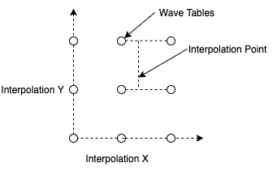

# Oscillators and WaveShapes

Oscillators can be combined with different WaveShapes to produce repeating wave forms. 

All oscillators have a process method wich must be called at the specified sample rate in order to give the next sample. It is up to your code to call this at the correct rate.

```cpp
float sample = oscillator.process();
```

## WaveOscillator

Basic oscillator which uses any WaveShape to produce a repeating wave form. 

### Instantiation

There are 2 basic ways of instantiating a WaveOscillator.

The first way is to let the oscillator instantiate it's own WaveShape object, you just need to tell it the type of the WaveShape you want e.g. to create a basic Sine wave oscillator:

``` cpp
WaveOscillator<Sine> oscillator;
```

The second way is to instantiate the WaveShape yourself, outside of the oscillator, and give the oscillator a reference to it:

```
Sine sine;
WaveOscillator<Sine&> oscillator = WaveOscillator(sine);
```

### Initialisation

The oscillator must be initialised with the sample rate before it can be used:

``` cpp
oscillator.init(sampleRate);
```

### Parameters

Other parameters that can be set are:

- **Frequency**

Set frequency in Hz.

``` cpp
oscillator.setFrequency(frequency);
```

- **Amplitude** 

Set amplitude, nomrmally between 0 and 1.

``` cpp
oscillator.setAmplitude(amplitude);
```

- **Period**

Does the same as setting the frequency but using the wave period in seconds instead.

``` cpp
oscillator.setPeriod(period);
```

- **Phase**

The phase is automatically incremented by the process function but can also be reset or set to any point manually. Phase should be between 0 and 1.

``` cpp
oscillator.setPhase(phase);
```

- **Polyblep**

Polyblep can be enabled but only has an effect if the WaveShape supports it.

``` cpp
oscillator.setPolyblep(true);
```

---

## WaveShapes

Shapes used by an oscillator. Some shapes support polyblep, which is a means of bandlimiting a waveshape so that aliasing artifacts are reduced when played at higher frequencies. Polyblep must be turned on at the oscillator level.


### Sine

A basic sine wave.


### Pulse

A pulse wave shape. Supports polyblep.

- **Width**

Set the width of the pulse from 0 (very short pulse), to 1 (long pulse)

```cpp
pulse.setWidth(pulseWidth);
```


### Triangle

A basic triangle wave. Supports polyblep.


### Saw

A basic saw wave. Supports polyblep.


### AsymmetricalTriangle

A triangle wave with the optional to move the point from sawtooth to ramp wave.

- **Peak Position**

Set the position of the peak from 0 to 1.

```cpp
triangle.setPeakPosition(peakPosition);
```


### Line

A Line is intended to be used as part of a longer WaveSequence although it could be used on it's own to create a ramp or saw like wave form

A line has the following parameters:

- **Start Value**: The amplitude at the start of the line.
- **End Value**: The amplitude of the end of the line.
- **Length**: The length of the line measured as a fraction of the total phase of the waveform.


### WaveSequence

Used to put together multiple other WaveShapes to create a longer WaveShape. Can also be use for envelopes. The WaveShape types must be specified as tempalte parameters. e.g A wave made from 3 lines:

``` cpp
WaveSequence<3, Line> lineShape;
```

The properties of each individual segment of the sequence can be changed, e.g. for a sequence made of lines:

```cpp
lineShape.segment(0).setStartValue(-0.8);
lineShape.segment(0).setEndValue(0.8);
lineShape.segment(0).setLength(0.2);
lineShape.segment(1).setStartValue(0.8);
lineShape.segment(1).setEndValue(0.8);
lineShape.segment(1).setLength(0.6);
lineShape.segment(2).setStartValue(0.8);
lineShape.segment(2).setEndValue(-0.8);
lineShape.segment(2).setLength(0.2);
```

If used with an oscillator, the total length of the sequence should add up to 1, otherwise the oscillator frequency calculations would play it back at the wrong frequency.

If the end position of a segment does not match the start position of the next segment then a jump will occur.


### WaveTable

A WaveTable represents a range of lookup tables of values for a single cycle of a waveform. There can be a slightly different lookup table used depending on the frequency of playback. This can be used to reduce aliasing by removing higher harmonics from the higher frequency lookup tables.

For more complex waveforms containing multiple harmonics, this is often the most efficient way to synthesise, since the wave form is pre-calculated.

WaveTable uses template parameters to set number of tables and the sample size of each table. By default the number of tables is evenly distributed over a 10 octave range, so to create a WaveTable with one table per octave you can use:

```cpp
WaveTable<10, 128> waveTable;
```

Before a WaveTable can be used, it needs to be initialised with a memory pool for storage space. see [MemPool](util.md#MemPool) for more details about initialising memory pools.

```cpp
waveTable.init(memPool);
```

There are some factory methods to create WaveTable waves by adding together sines. e.g. add 2 sines into a wavetable, one with double the frequency of the other:

```cpp
WaveTableFactory::addSine(&waveTable, 0.5, 1);
WaveTableFactory::addSine(&waveTable, 0.5, 2);
```

The full list of functions for creating wavetables:

```cpp
WaveTableFactory::addSine(BaseWaveTable* wavetable, float amplitude = 0.5, int mult = 1, float phaseShift = 0);
WaveTableFactory::addSquare(BaseWaveTable* wavetable, float amplitude = 0.5, int mult = 1);
WaveTableFactory::addTriangle(BaseWaveTable* wavetable, float amplitude = 0.5, int mult = 1);
WaveTableFactory::addRamp(BaseWaveTable* wavetable, float amplitude = 0.5, int mult = 1);
WaveTableFactory::addPulse(BaseWaveTable* wavetable, float amplitude = 0.5, int mult = 1);
WaveTableFactory::addImpulse(BaseWaveTable* wavetable, float amplitude = 0.5, int mult = 1);
WaveTableFactory::addViolin(BaseWaveTable* wavetable, float amplitude = 0.5, int mult = 1);
WaveTableFactory::addHarmonics(BaseWaveTable* wavetable, RollOffFunction* rolloff, float amplitude = 0.5, int mult = 1);
```

These functions create their waveshapes by adding together sines. To prevent aliasing, they don't add frequencies that are higher than half the sample rate, so the tables for higher frequencies will contain less harmonics. The highest frequency table may well be a single sine wave.

Also note, that these functions generate the tables at runtime, so they may introduce a time delay before the module can be used.

The addHarmonics function requires a RollOffFunction. This is a function that given the harmonic number will tell us what the amplitude of the sine is for that harmonic. The other functions use a RollOffFunction for their specific wave forms, but you can implement your own and use it with this function. Examples of these can be found in [RollOffFunction.h]({{ site.repolink }}/src/dsp/waveshapes/wavetable/RollOffFunction.h)


### WaveSelector

Allows a single WaveShape to be selected from a list at runtime. The WaveShapes to be selected from can be added as template parameters. Since the template names can get lengthy a typedef can be used:

```cpp
typedef WaveSelector<Sine, Triangle, Saw, Pulse> WaveSelectionT;
WaveSelectionT waveSelector;
WaveOscillator<WaveSelectionT&> oscillator = WaveOscillator<WaveSelectionT&>(waveSelector);
```

Then, at runtime, a selection can be made to change which wave the oscillator uses. The select function uses the index of the waveform in the list.

```cpp
waveSelector.select(2);
```


### WaveInterpolator

Similar to WaveSelector, except that it smoothly interpolates the values between wave forms.

For example, to smoothly interpolate between 4 wave shapes:

```cpp
typedef WaveInterpolator<Sine, Triangle, Saw, Pulse> WaveInterpolationT;
WaveInterpolationT interpolator;
WaveOscillator<WaveInterpolationT&> oscillator = WaveOscillator<WaveInterpolationT&>(interpolator);
```

Then, at runtime, the position can be selected using a floating point number between 0 and 3 (The number of wave shapes used). 0 will be a Sine, anything between 0 and 1 will an interpolation between Sine and Triangle, 1 will be Triangle, etc.

```cpp
waveSelector.setInterpolation(1.3);
```


#### WaveArrayInterpolator

A variation of WaveInterpolator that allows the same WaveShape class to be repeated multple times in the template. Most usefult with a WaveShape such as WaveTable which can use the same class to hold different waveforms.

For example, an interpolator over 3 WaveTables:

```cpp
typedef WaveTable<10, 128> WaveTableT;
typedef WaveArrayInterpolator<WaveTableT, 3> WaveInterpolationT;
WaveInterpolationT interpolator;
WaveOscillator<WaveInterpolationT&> oscillator = WaveOscillator<WaveInterpolationT&>(interpolator);
```

Each WaveTable can be accessed using the array operator, and can be initialised with differrent waves:

```cpp
WaveTableFactory::addSine(&interpolator[0], 0.5);
WaveTableFactory::addRamp(&interpolator[1], 0.5);
WaveTableFactory::addSquare(&interpolator[2], 0.5);
```

#### WaveInterpolator2D and WaveInterpolator3D

Variations of WaveArrayInterpolator extends to 2 and 3 dimensions.

Example:

```cpp
typedef WaveTable<10, 128> WaveTableT;
typedef WaveInterpolator2D<WaveTableT, 2, 2> WaveInterpolationT;
WaveInterpolationT interpolator;
WaveOscillator<WaveInterpolationT&> oscillator = WaveOscillator<WaveInterpolationT&>(interpolator);
```

The wavetable at each point needs to be initialised:

```cpp
WaveTableFactory::addSine(&interpolator[0][0], 0.5);
WaveTableFactory::addRamp(&interpolator[1][0], 0.5);
WaveTableFactory::addSquare(&interpolator[0][1], 0.5);
WaveTableFactory::addTriangle(&interpolator[1][1], 0.5);
```

X, Y and Z interpolation can be set separately:

```cpp
interpolator.setInterpolationX(0.3);
interpolator.setInterpolationY(0.4);
interpolator.setInterpolationZ(0.5);
```

