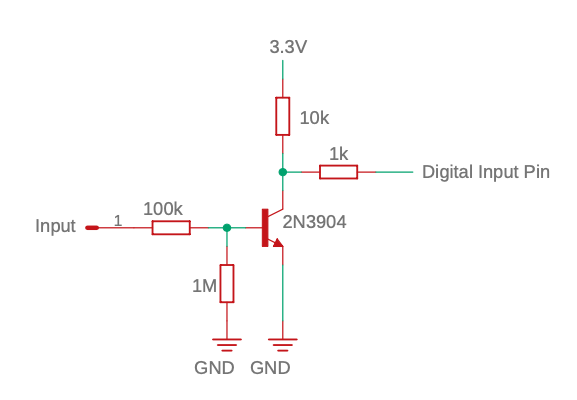

# Usage

Include the library with 

    include <eurorack.h>
    
Initialise the library with

    Eurorack::init();

## Defining Pin Types

All pins are represented by a DevicePin object. These are provided by either a secondary device or can be one of the pins directly connected to the microcontroller.
For the latter there are some macros with can be used to create the pin objects

### Analog Input

    AnalogInput(analogInputPin, A8)

Where analogInputPin is the name of the variable created to represent the pin and A8 is the arduino analog pin number. This is a macro which creates an object of type `AnalogInputPin<NativeDevice>`

Recommended circuit. Uses an inverting rail-to-rail op-amp powered by 3.3V. Scales an input of -5V/5V to 3.3V/0V required by the Arduino. 
The values are then re-inverted by the library code. Requires a -5V reference voltage.

### Digital Input

    DigitalInput(digitalInputPin, 0)

Where digitalInputPin is the name of the variable created to represent the pin and 0 is the arduino digital pin number. This is a macro which creates an object of type `DigitalInputPin<NativeDevice>`

Recommended circuit.

### Digital Output

    DigitalOutput(digitalOutputPin, 1)

Where digitalOutputPin is the name of the variable created to represent the pin and 1 is the arduino digital pin number. This is a macro which creates an object of type `DigitalOutputPin<NativeDevice>`
